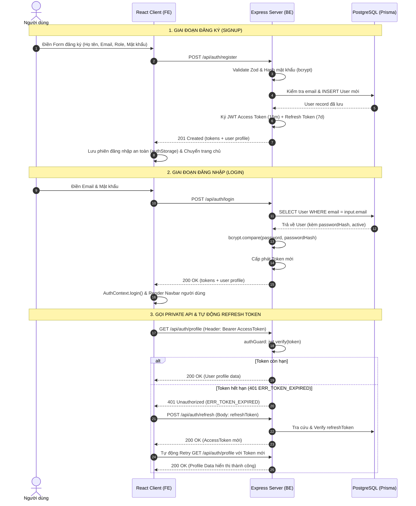

# 🔐 Tài Liệu Đặc Tả & Hướng Dẫn Kỹ Thuật: Login, Register & Verify (PlotFarm)

> **Tài liệu hệ thống**: Quản lý Xác thực (Authentication), Cấp quyền (Authorization), và Kiểm tra dữ liệu (Verification) của dự án **PlotFarm**.  
> **Cập nhật lần cuối**: Ngày 13 tháng 09, 2026.  
> **Phạm vi áp dụng**: Monorepo (`apps/client`, `apps/server`, `packages/shared`, `packages/database`).

---

## 📑 Mục lục
1. [Kiến trúc Tổng quan](#1-kiến-trúc-tổng-quan)
2. [Tính năng Đăng ký tài khoản (Register / Signup)](#2-tính-năng-đăng-ký-tài-khoản-register--signup)
3. [Tính năng Đăng nhập (Login / Signin)](#3-tính-năng-đăng-nhập-login--signin)
4. [Cơ chế Xác thực & Kiểm tra (Verify)](#4-cơ-chế-xác-thực--kiểm-tra-verify)
   - [4.1. Verify Access Token (AuthGuard)](#41-verify-access-token-authguard)
   - [4.2. Verify & Refresh Token (Token Rotation)](#42-verify--refresh-token-token-rotation)
   - [4.3. Verify Dữ liệu đầu vào (Zod Input Validation)](#43-verify-dữ-liệu-đầu-vào-zod-input-validation)
   - [4.4. Verify Email & Trạng thái tài khoản (Email Verification)](#44-verify-email--trạng-thái-tài-khoản-email-verification)
5. [Danh mục API Endpoints & Mã lỗi chuẩn (Error Codes)](#5-danh-mục-api-endpoints--mã-lỗi-chuẩn-error-codes)
6. [Sơ đồ Luồng Hoạt Động (Sequence Diagram)](#6-sơ-đồ-luồng-hoạt-động-sequence-diagram)

---

## 1. Kiến trúc Tổng quan

Hệ thống Authentication của PlotFarm được thiết kế đồng bộ theo mô hình **FSD (Feature-Sliced Design)** ở Client và **Modular Layered Architecture** ở Backend, kết hợp cùng **Domain Contracts** dùng chung:

```
┌────────────────────────────────────────────────────────┐
│               packages/shared (@repo/shared)           │
│  - UserRole: 'CUSTOMER' | 'STAFF' | 'ADMIN'            │
│  - Schemas: LoginRequestSchema, RegisterRequestSchema   │
│  - ERROR_CODES: ERR_UNAUTHORIZED, ERR_TOKEN_EXPIRED... │
└──────────────┬───────────────────────────┬─────────────┘
               │                           │
               ▼                           ▼
┌─────────────────────────────┐ ┌─────────────────────────────┐
│    apps/client (Frontend)   │ │    apps/server (Backend)    │
│  - LoginForm, SignupForm    │ │  - AuthController           │
│  - AuthContext, authStorage │ │  - TokenService (JWT)       │
│  - axiosClient (Auto-retry) │ │  - authGuard Middleware     │
│  - Navbar Auth State        │ │  - Prisma ORM (@repo/db)    │
└─────────────────────────────┘ └─────────────────────────────┘
```

---

## 2. Tính năng Đăng ký tài khoản (Register / Signup)

### 2.1. Phía Frontend (`apps/client`)
* **Giao diện & Form**:
  - File: [`apps/client/src/features/auth/ui/RegisterFormPanel.tsx`](file:///d:/Project/plot-farm/apps/client/src/features/auth/ui/RegisterFormPanel.tsx) & [`LoginPage.tsx`](file:///d:/Project/plot-farm/apps/client/src/features/auth/ui/LoginPage.tsx)
  - Routes: `/register`, `/signup`
  - Các trường dữ liệu (sắp xếp 1 cột dọc duy nhất, trực quan trên mọi thiết bị):
    - `fullName`: Họ và tên đầy đủ.
    - `email`: Địa chỉ email (định dạng chuẩn RFC).
    - `password`: Mật khẩu đăng nhập (tối thiểu 6 ký tự).
    - `confirmPassword`: Xác nhận lại mật khẩu (phải khớp với mật khẩu trên).
  - **Tối ưu hóa UX**: Đã loại bỏ khối chọn vai trò (`role selector`), mặc định toàn bộ tài khoản đăng ký mới có vai trò `CUSTOMER`. Tiêu đề đặt trực tiếp trên đầu form, loại bỏ thanh TabSwitch trên đỉnh.
* **Xử lý sự kiện**:
  - Gửi request `POST /api/auth/register` (hoặc action `auth.register` qua `/api/gateway`).
  - Nhận kết quả thành công: Tự động lưu thông tin vào `sessionStorage` (`authSession`) và chuyển hướng về trang chủ `/`.

### 2.2. Phía Backend (`apps/server`)
* **Endpoint**: `POST /api/auth/register` (hỗ trợ cả qua API Gateway `/api/gateway` với action `auth.register`)
* **Controller**: [`AuthController.register`](file:///d:/Project/plot-farm/apps/server/src/modules/auth/auth.controller.ts)
* **Quy trình xử lý nghiệp vụ**:
  1. **Validation**: Kiểm tra body bằng `RegisterSchema` (Zod).
  2. **Kiểm tra trùng lặp**: Tra cứu trong DB (hoặc `memoryUsers` cache) xem `email` đã được đăng ký chưa; nếu có trả về `409 Conflict` (`ERROR_CODES.DUPLICATE`).
  3. **Mã hóa mật khẩu**: Sử dụng `bcryptjs` với hệ số làm tròn `saltRounds = 10`.
  4. **Tạo mã người dùng**: Sinh tự động `userCode` chuẩn định dạng `USR-xxxxxx`.
  5. **Lưu trữ DB & Dev In-Memory Fallback**: Thêm bản ghi mới vào bảng `User` thông qua Prisma Client; nếu DB chưa kết nối ở môi trường dev, tự động lưu vào `memoryUsers` Map để không gây lỗi gián đoạn.
  6. **Cấp phát JWT**: Tạo ngay bộ cặp `accessToken` (hạn 15 phút) và `refreshToken` (hạn 7 ngày).

---

## 3. Tính năng Đăng nhập (Login / Signin)

### 3.1. Phía Frontend (`apps/client`)
* **Giao diện & Form**:
  - File: [`apps/client/src/features/auth/ui/LoginForm.tsx`](file:///d:/Project/plot-farm/apps/client/src/features/auth/ui/LoginForm.tsx)
  - Route: `/login`
  - Các trường dữ liệu:
    - `email / username`: Địa chỉ email hoặc tên tài khoản.
    - `password`: Mật khẩu.
    - Tuỳ chọn "Ghi nhớ đăng nhập" (Remember me).
* **Quản lý phiên đăng nhập**:
  - Sử dụng [`AuthContext.tsx`](file:///d:/Project/plot-farm/apps/client/src/app/providers/AuthContext.tsx) và [`authStorage.ts`](file:///d:/Project/plot-farm/apps/client/src/auth/authStorage.ts).
  - Tự động bắt lỗi nếu dữ liệu `LocalStorage` bị hỏng (EH-1), chuyển an toàn về trạng thái Khách (Guest) mà không gây crash màn hình React.

### 3.2. Phía Backend (`apps/server`)
* **Endpoint**: `POST /api/auth/login` (hoặc alias `POST /api/auth/signin`)
* **Controller**: [`AuthController.login`](file:///d:/Project/plot-farm/apps/server/src/modules/auth/auth.controller.ts)
* **Quy trình xử lý nghiệp vụ**:
  1. **Validation**: Kiểm tra `email` và `password` không được để trống.
  2. **Truy vấn người dùng**: Tìm User theo `email`. Nếu không tìm thấy trả về `401 Unauthorized` (`ERROR_CODES.UNAUTHORIZED`).
  3. **Kiểm tra trạng thái kích hoạt**: Nếu `user.active === false`, từ chối truy cập và trả về `403 Forbidden` (`ERROR_CODES.ACCOUNT_DISABLED`).
  4. **So khớp mật khẩu**: Sử dụng `bcrypt.compare(password, user.passwordHash)`. Nếu sai mật khẩu trả về `401 Unauthorized`.
  5. **Cập nhật thời gian**: Ghi nhận `lastLoginAt = new Date()`.
  6. **Cấp phát JWT**: Sinh cặp Token và gửi về Client với mã HTTP `200 OK`.

---

## 4. Cơ chế Xác thực & Kiểm tra (Verify)

Hệ thống Verify được chia thành **4 tầng độc lập**:

### 4.1. Verify Access Token (AuthGuard)
* **Mục đích**: Bảo vệ các Private API (như `/profile`, `/plots/rent`, `/contracts`,...).
* **Vị trí**: [`apps/server/src/middlewares/authGuard.ts`](file:///d:/Project/plot-farm/apps/server/src/middlewares/authGuard.ts)
* **Quy trình**:
  1. Kiểm tra header `Authorization: Bearer <token>`.
  2. Dùng thư viện `jsonwebtoken` và secret `JWT_ACCESS_SECRET` để giải mã (`jwt.verify`).
  3. Bắt chính xác các lỗi:
     - Hết hạn token: `TokenExpiredError` ➔ trả về `ERROR_CODES.TOKEN_EXPIRED` (HTTP 401).
     - Token sai chữ ký: `JsonWebTokenError` ➔ trả về `ERROR_CODES.INVALID_TOKEN` (HTTP 401).
  4. Kiểm tra User trong Database: Đảm bảo tài khoản vẫn tồn tại và `active === true`.
  5. Đính kèm thông tin vào request:
     ```typescript
     req.user = { userId, email, role };
     req.userId = user.id;
     req.userRole = user.role;
     ```

### 4.2. Verify & Refresh Token (Token Rotation)
* **Mục đích**: Tự động gia hạn phiên làm việc của người dùng mà không bắt đăng nhập lại.
* **Backend**:
  - Endpoint: `POST /api/auth/refresh`
  - Service: [`TokenService.refreshAccessToken`](file:///d:/Project/plot-farm/apps/server/src/modules/auth/token.service.ts)
  - Giải mã refresh token bằng `JWT_REFRESH_SECRET`, kiểm tra bản ghi trong bảng `RefreshToken` của DB và cấp phát `accessToken` mới.
* **Frontend**:
  - File: [`apps/client/src/api/axiosClient.ts`](file:///d:/Project/plot-farm/apps/client/src/api/axiosClient.ts)
  - Khi bất kỳ request nào nhận về lỗi `401 TOKEN_EXPIRED`, interceptor sẽ tự động giữ request vào hàng đợi, gọi ngầm API `/api/auth/refresh` và retry lại request ban đầu một cách liền mạch.

### 4.3. Verify Dữ liệu đầu vào (Zod Input Validation)
* **Vị trí**: [`packages/shared/src/auth.ts`](file:///d:/Project/plot-farm/packages/shared/src/auth.ts)
* **Các Schemas cốt lõi**:
  - `LoginRequestSchema`: Validate định dạng email và độ dài mật khẩu.
  - `RegisterRequestSchema`: Validate họ tên, email, mật khẩu, số điện thoại (regex quốc tế), ngôn ngữ ưu tiên (`vi` / `en`).
  - `RefreshTokenRequestSchema`: Kiểm tra refresh token không được để trống.

### 4.4. Verify Email & Trạng thái tài khoản (Email Verification)
* **Cấu trúc Database**:
  - Bảng `User` trong [`schema.prisma`](file:///d:/Project/plot-farm/packages/database/prisma/schema.prisma) đã có sẵn trường:
    ```prisma
    isVerified  Boolean  @default(false) @map("is_verified")
    ```
* **Luồng tích hợp Email (Theo Roadmap)**:
  1. Sau khi người dùng đăng ký, hệ thống gửi email kích hoạt chứa token xác thực tạm thời thông qua **Resend** hoặc **Nodemailer**.
  2. Người dùng bấm vào đường dẫn: `http://localhost:3000/auth/verify-email?token=...`.
  3. Frontend gọi API `POST /api/auth/verify-email` lên server để chuyển `isVerified = true`.

---

## 5. Danh mục API Endpoints & Mã lỗi chuẩn (Error Codes)

### 5.1. Bảng Endpoints Authentication

| Method | Endpoint | Quyền hạn (Auth) | Mô tả |
| :--- | :--- | :--- | :--- |
| `POST` | `/api/auth/register` | Public | Đăng ký tài khoản mới (Customer / Staff) |
| `POST` | `/api/auth/signup` | Public | Alias tương thích cho `/register` |
| `POST` | `/api/auth/login` | Public | Đăng nhập tài khoản & nhận tokens |
| `POST` | `/api/auth/signin` | Public | Alias tương thích cho `/login` |
| `POST` | `/api/auth/refresh` | Public | Gia hạn Access Token bằng Refresh Token |
| `GET` | `/api/auth/profile` | Bearer Token (`authGuard`) | Lấy thông tin tài khoản đang đăng nhập |

### 5.2. Danh mục Mã Lỗi Chuẩn (`ERROR_CODES`)

| Key Error Code | Giá trị trả về | HTTP Status | Trường hợp xảy ra |
| :--- | :--- | :---: | :--- |
| `ERR_AUTH_REQUIRED` | `"ERR_AUTH_REQUIRED"` | 401 | Không truyền Bearer token trong header |
| `ERR_INVALID_TOKEN` | `"ERR_INVALID_TOKEN"` | 401 | Token bị sai chữ ký hoặc giải mã thất bại |
| `ERR_TOKEN_EXPIRED` | `"ERR_TOKEN_EXPIRED"` | 401 | Token đã hết hạn 15 phút |
| `ERR_INVALID_REFRESH_TOKEN` | `"ERR_INVALID_REFRESH_TOKEN"` | 401 | Refresh token không hợp lệ hoặc đã bị thu hồi |
| `ERR_USER_NOT_FOUND` | `"ERR_USER_NOT_FOUND"` | 401 | ID trong token không khớp với bất kỳ user nào trong DB |
| `ERR_ACCOUNT_DISABLED` | `"ERR_ACCOUNT_DISABLED"` | 403 | Tài khoản bị quản trị viên khóa (`active = false`) |
| `ERR_DUPLICATE` | `"ERR_DUPLICATE"` | 409 | Email đăng ký đã tồn tại trong hệ thống |
| `ERR_VALIDATION` | `"ERR_VALIDATION"` | 400 | Body request sai định dạng Zod Schema |

---

## 6. Sơ đồ Luồng Hoạt Động (Sequence Diagram)

### Luồng Đăng ký & Đăng nhập (Register ➔ Login ➔ Protected Access)



---

## 7. Hướng Dẫn Kiểm Thử (Testing Guide)

### 7.1. Chạy Unit Test tự động:
```bash
# Kiểm tra toàn bộ test suites của Server, Client và Shared
pnpm -r test
```

### 7.2. Thử nghiệm thực tế trên trình duyệt:
1. Mở trang đăng ký: [http://localhost:3000/signup](http://localhost:3000/signup).
2. Điền họ tên, chọn vai trò (`Khách thuê vườn` hoặc `Kỹ thuật viên`), nhập mật khẩu và bấm **Đăng ký**.
3. Quan sát: Hệ thống tự động chuyển hướng và trên thanh Navbar góc phải sẽ xuất hiện tên người dùng cùng nút **Logout**.
4. Bấm **Logout** và đăng nhập lại tại [http://localhost:3000/login](http://localhost:3000/login) với email/mật khẩu vừa tạo.
