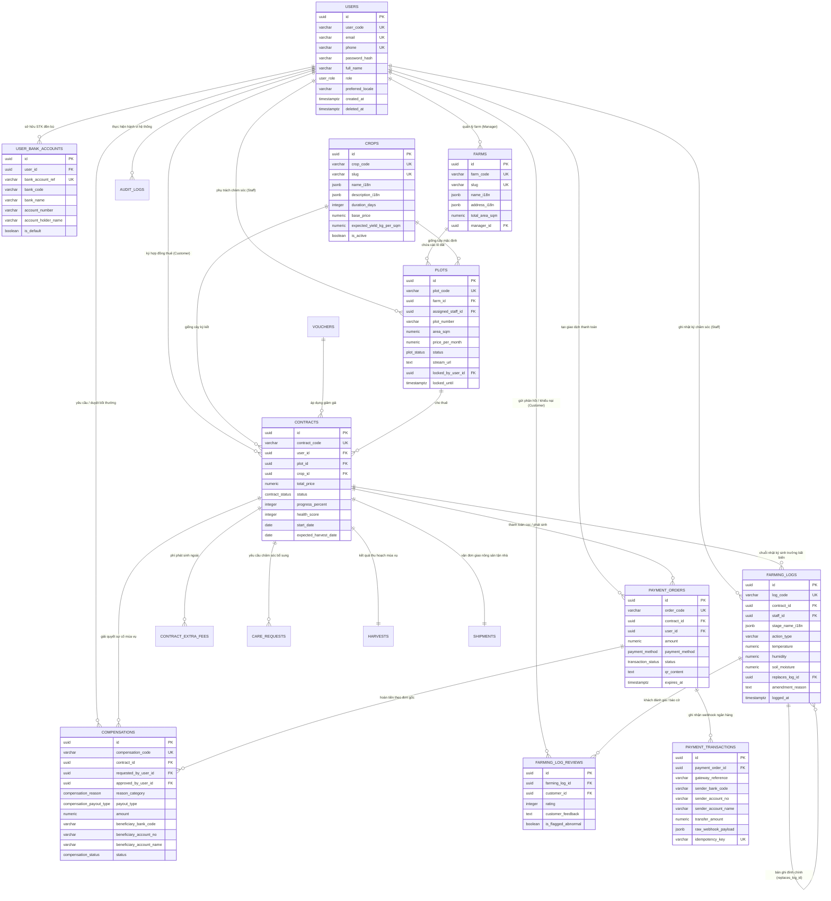

# 🌾 TÀI LIỆU THIẾT KẾ CƠ SỞ DỮ LIỆU & KIẾN TRÚC ERD (PLOTFARM v2.0)

> **Dự án:** Nền tảng Nông trại Thực nghiệm Công nghệ cao PlotFarm  
> **Tài liệu nguồn DBML:** [`docs/DATABASE_SCHEMA.dbml`](./DATABASE_SCHEMA.dbml)  
> **Tài liệu đặc tả API liên kết:** [`docs/API_SPECIFICATION.md`](./API_SPECIFICATION.md)  
> **Xem trực quan nhanh:** Mở file này trên VS Code/GitHub (hỗ trợ hiển thị sơ đồ Mermaid tự động bên dưới) hoặc copy [`DATABASE_SCHEMA.dbml`](./DATABASE_SCHEMA.dbml) vào [dbdiagram.io](https://dbdiagram.io/d).

---

## 1. SƠ ĐỒ THỰC THỂ QUAN HỆ TRỰC QUAN (MERMAID ERD)

---

## 2. PHÂN TÍCH 5 TRỤ CỘT THIẾT KẾ ĐÁP ỨNG YÊU CẦU

### 2.1. Trụ cột 1: Bảo mật định danh bằng Business Code thay cho Database UUID/ID
* **Vấn đề an ninh (OWASP API Top 10):** Trả trực tiếp Database ID (như `id: 1` hoặc UUID `id: "9b1deb4d-3b7d..."`) ra client làm tăng nguy cơ tấn công **BOLA (Broken Object Level Authorization)** và làm lộ khóa chính nội bộ.
* **Giải pháp v2.0:** Mọi thực thể có một `code` hoặc `slug` công khai duy nhất:
  - Khách hàng: `userCode` (`USR-CUST-001`).
  - Lô đất: `plotCode` (`PLT-A01`).
  - Cây trồng: `cropCode` (`CRP-TOMATO-01`) & `cropSlug` (`ca-chua-cherry`).
  - Hợp đồng: `contractCode` (`PF-2026-0915-A01`).
  - Lệnh đền bù: `compensationCode` (`CMP-2026-0015`).
  - Nhật ký chăm sóc: `logCode` (`LOG-2026-0035`).

---

### 2.2. Trụ cột 2: Chuẩn phản hồi Envelope `meta - data - pagination` & Chống Spam
* **Tách riêng `pagination` ở root level:** Không nhét phân trang vào trong `meta`. Client xử lý dữ liệu rõ ràng:
  - `meta`: Metadata truy vết (`correlationId`, `traceId`, `userCode`, `timestamp`, `rateLimit`).
  - `data`: Mảng bản ghi hoặc đối tượng dữ liệu.
  - `pagination`: Thông số trang (`page`, `pageSize`, `totalItems`, `totalPages`, `hasNextPage`, `hasPreviousPage`).
* **Đánh dấu phát hiện Spam API (`meta.rateLimit.isSpamWarning`):**
  - Giám sát quota gọi API theo thời gian thực.
  - Tự động bật `isSpamWarning = true` khi tần suất gọi vượt ngưỡng an toàn trước khi kích hoạt mã lỗi `429 TOO_MANY_REQUESTS`.

---

### 2.3. Trụ cột 3: Scale trích xuất người chuyển khoản & Thiết lập đền bù
* **Vấn đề thực tiễn:** Khi khách hàng quét VietQR, số tài khoản thanh toán có thể là tài khoản của người thân hoặc tài khoản phụ. Nếu chỉ có bảng `payments` thô sơ, khi nông sản bị ngập lụt, Admin không có dữ liệu để đối soát và không biết tài khoản nào để chuyển tiền đền bù.
* **Giải pháp 3 tầng:**
  1. **Lớp Tiếp nhận đơn (`payment_orders`):** Quản lý trạng thái đơn thanh toán, chuỗi EMVCo VietQR, thời gian hết hạn (15 phút).
  2. **Lớp Sổ cái Ngân hàng (`payment_transactions`):** Lưu trữ chính xác dữ liệu từ Webhook:
     - `sender_bank_code`: Mã ngân hàng người chuyển (Vd: `970422` - MBBank).
     - `sender_account_no`: Số tài khoản người chuyển.
     - `sender_account_name`: Tên chủ tài khoản chuyển tiền.
     - `raw_webhook_payload`: Lưu trọn vẹn JSON từ ngân hàng để kiểm toán đối soát.
     - `idempotency_key`: Chống cộng tiền lặp khi ngân hàng retry webhook.
  3. **Lớp Giải quyết đền bù (`compensations`):**
     - Liên kết trực tiếp với tài khoản người gửi tiền ban đầu hoặc tài khoản đã đăng ký trong `user_bank_accounts`.
     - Quy trình thẩm duyệt rõ ràng: Khách hàng/Staff gửi yêu cầu ➔ Admin duyệt (`approved_by_user_id`) ➔ Tạo mã chuyển khoản hoàn tiền (`payout_reference`).

---

### 2.4. Trụ cột 4: Hỗ trợ đa ngôn ngữ trên giao diện (Localization / i18n)
* **Giải pháp tối ưu:** Sử dụng **PostgreSQL JSONB** (`name_i18n`, `description_i18n`, `soil_type_i18n`, `stage_name_i18n`).
* **Tại sao không dùng bảng dịch riêng (`crop_translations`)?**
  - Không phải thực hiện phép `JOIN` 4 - 5 bảng phức tạp cho mỗi câu truy vấn.
  - Tốc độ đọc O(1) từ chỉ mục nhị phân JSONB của PostgreSQL.
  - Hỗ trợ thêm bất kỳ ngôn ngữ mới nào (`vi`, `en`, `ja`, `ko`) mà **không cần chạy migration sửa cấu trúc bảng**.
* **Trải nghiệm Frontend (DX & UX):**
  - Backend trả về toàn bộ object đa ngữ. Frontend lưu vào cache (Zustand/React Query). Khi người dùng click nút đổi cờ `EN ➔ VI` trên Header, UI render lại ngay lập tức **trong 0ms** mà không tốn thêm request mạng.

---

### 2.5. Trụ cột 5: Phân quyền 3 Role & Tính minh bạch nhật ký chăm sóc

#### A. Ma trận phân quyền 3 Role (Customer - Staff - Admin)
* **`CUSTOMER` (Khách thuê):**
  - Chỉ xem và thao tác trên hợp đồng của chính mình (`contracts.user_id = auth.userId`).
  - Được xem camera, chỉ số IoT, nhật ký chăm sóc của mảnh đất mình thuê.
  - Được tạo yêu cầu dịch vụ (`care_requests`) và khiếu nại đền bù (`compensations`).
* **`STAFF` (Kỹ thuật viên trang trại):**
  - Chỉ được xem và ghi nhật ký trên các lô đất được gán trách nhiệm (`plots.assigned_staff_id = auth.userId`).
  - Ghi nhận giai đoạn phát triển, sản lượng thu hoạch, cập nhật mã vận đơn.
  - **Tuyệt đối không có quyền:** Xem dữ liệu thanh toán nhạy cảm, không được duyệt tiền đền bù, không được sửa giá đất.
* **`ADMIN` (Quản trị viên toàn hệ thống):**
  - Thẩm duyệt lệnh đền bù tài chính (`approved_by_user_id`).
  - Quản trị danh mục Farm, Đất, Cây, Voucher và phân bổ nhân sự.
  - Truy vết lịch sử hành vi thông qua bảng `audit_logs`.

#### B. Cơ chế bảo vệ tính minh bạch nhật ký chăm sóc (Anti-Tamper Care Logs)
> **Rủi ro thực tế:** Kỹ thuật viên quên tưới cây làm chết rau, sau đó âm thầm vào sửa log cũ để trốn tránh trách nhiệm.

Hệ thống thiết lập **4 lớp rào chắn kỹ thuật**:
1. **Nguyên tắc Bất biến (Append-Only):** Cấm lệnh `UPDATE` và `DELETE` trên bảng `farming_logs`. Nếu ghi nhầm, nhân viên bắt buộc phải tạo bản ghi đính chính (`replaces_log_id` + `amendment_reason`). Bản ghi cũ vẫn được lưu vết để đối chiếu.
2. **Đối chiếu chéo với cảm biến IoT tự động:** Khi gọi API ghi log, Backend tự động chụp snapshot độ ẩm đất (`soil_moisture`) và nhiệt độ (`temperature`) từ Gateway IoT. Nếu nhân viên khai "Đã tưới nước" mà cảm biến báo đất khô kiệt ➔ Hệ thống tự động cảnh báo nghi vấn.
3. **Phản biện 2 chiều từ khách hàng (`farming_log_reviews`):** Khách hàng xem ảnh/camera, nếu phát hiện bất thường có quyền bật cờ `is_flagged_abnormal = true`.
4. **Cảnh báo vượt cấp:** Mọi cờ bất thường sẽ được chuyển thẳng về màn hình quản trị của **ADMIN** để thanh tra độc lập mà Kỹ thuật viên không thể tự ý xóa bỏ.

---

## 3. DANH MỤC CÁC BẢNG TRONG CƠ SỞ DỮ LIỆU

| STT | Tên bảng | Public Business Code | Chức năng nghiệp vụ | Ràng buộc chính |
| :---: | :--- | :--- | :--- | :--- |
| 1 | `users` | `user_code` | Tài khoản khách hàng, nhân viên, quản trị viên | `user_code`, `email`, `phone` Unique |
| 2 | `user_bank_accounts` | `bank_account_ref` | Danh sách tài khoản ngân hàng nhận hoàn tiền/đền bù | `bank_account_ref` Unique |
| 3 | `farms` | `farm_code`, `slug` | Danh mục các trang trại thực nghiệm đối tác | `farm_code`, `slug` Unique, đa ngữ JSONB |
| 4 | `crops` | `crop_code`, `slug` | Danh mục giống rau củ, tiêu chuẩn sinh trưởng | `crop_code`, `slug` Unique, đa ngữ JSONB |
| 5 | `plots` | `plot_code`, `plot_number`| Các lô đất cụ thể, liên kết camera và cảm biến | `plot_code` Unique, Khóa ngoại `farm_id` |
| 6 | `vouchers` | `code` | Mã khuyến mãi và chính sách giảm giá | `code` Unique |
| 7 | `contracts` | `contract_code` | Hợp đồng thuê đất giữa khách hàng và trang trại | `contract_code` Unique, Snapshot giá |
| 8 | `contract_extra_fees` | `id` (nội bộ) | Các khoản phụ phí phát sinh ngoài hợp đồng | Khóa ngoại `contract_id` |
| 9 | `payment_orders` | `order_code` | Đơn thanh toán và nội dung chuỗi VietQR EMVCo | `order_code` Unique, đếm ngược hết hạn |
| 10 | `payment_transactions` | `gateway_reference` | Sổ cái đối soát ngân hàng lưu nguồn chuyển tiền | `idempotency_key` Unique, lưu raw payload |
| 11 | `compensations` | `compensation_code` | Quy trình thẩm duyệt và giải ngân đền bù sự cố | `compensation_code` Unique, duyệt 2 bước |
| 12 | `farming_logs` | `log_code` | Nhật ký sinh trưởng bất biến đính kèm snapshot IoT | `log_code` Unique, Append-only |
| 13 | `farming_log_reviews` | `id` (nội bộ) | Khách hàng đánh giá chất lượng chăm sóc & báo cờ | Khóa ngoại `farming_log_id`, `customer_id` |
| 14 | `care_requests` | `request_code` | Yêu cầu chăm sóc đặc biệt theo yêu cầu của khách | `request_code` Unique, Khóa ngoại `contract_id` |
| 15 | `harvests` | `harvest_code` | Ghi nhận sản lượng thu hoạch thực tế và ảnh chứng thực | `harvest_code` Unique, Quan hệ 1-1 `contracts` |
| 16 | `shipments` | `tracking_code` | Vận đơn đóng gói và giao hàng đến tận nhà | `tracking_code` Unique, quan hệ 1-1 `contracts` |
| 17 | `audit_logs` | `audit_code` | Ghi vết kiểm toán hành vi người dùng và hệ thống | `audit_code` Unique, Lưu `old_state`, `new_state` |
