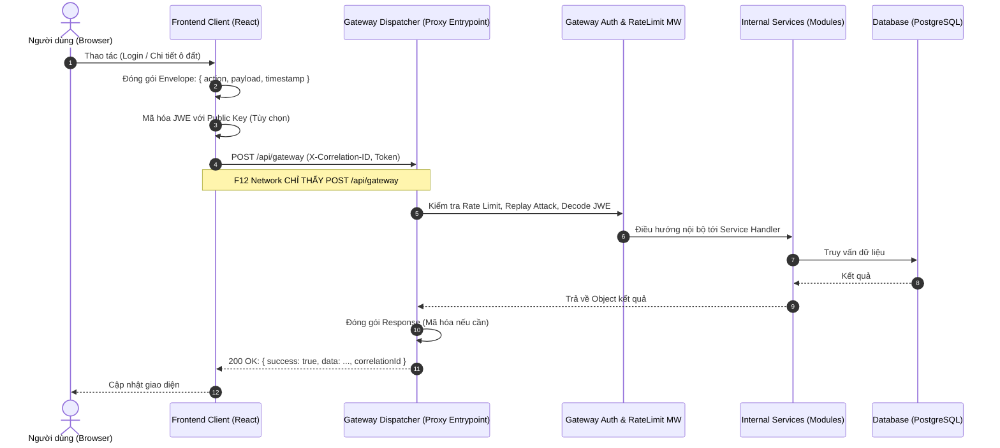
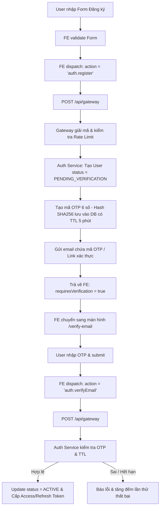
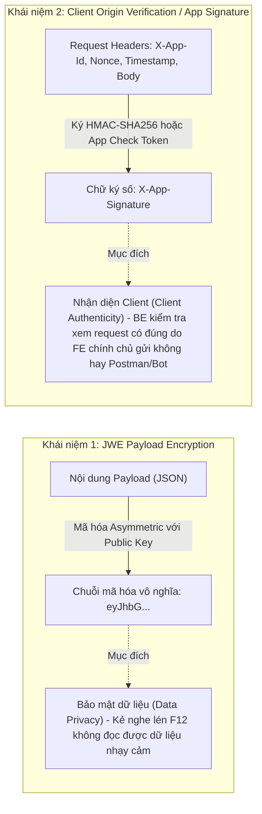

# TÀI LIỆU KIẾN TRÚC & ĐẶC TẢ TRIỂN KHAI HỆ THỐNG
## SINGLE-ENDPOINT PROXY GATEWAY & QUY TRÌNH XÁC THỰC E2E (PLOTFARM)

---

## 1. TỔNG QUAN VÀ MỤC TIÊU BẢO MẬT

### 1.1. Bối cảnh & Vấn đề của REST API truyền thống
Trong kiến trúc REST API tiêu chuẩn, trình duyệt (Client) gửi các request trực tiếp tới các endpoint tường minh như:
- `POST /api/auth/register`
- `POST /api/auth/login`
- `GET /api/plots/detail/:id`
- `POST /api/orders/checkout`
- `DELETE /api/admin/users/:id`

**Rủi ro bảo mật:**
1. **Lộ sơ đồ API (API Enumeration & Reconnaissance):** Kẻ tấn công mở DevTools (F12) tab Network là có thể lập bản đồ toàn bộ chức năng của hệ thống.
2. **Dò quét lỗ hổng trực diện (Targeted Scanning & Brute-Force):** Hacker có thể chạy các tool tự động (như Burp Suite, OWASP ZAP) nhắm thẳng vào các URL nhạy cảm (`/api/auth/login`, `/api/admin/*`) để tấn công dò mật khẩu, SQL Injection hoặc IDOR (Insecure Direct Object References).

### 1.2. Mục tiêu kiến trúc đề xuất
1. **Zero-Knowledge F12 (Che giấu 100% URL):** Bất kể hành động là Đăng nhập, Xem chi tiết ô đất, hay Đặt hàng, từ tab Network của Client chỉ xuất hiện **DUY NHẤT 1 ENDPOINT**:
   $$\text{Endpoint Duy Nhất: } \mathbf{POST\ /api/gateway}$$
2. **Payload Encrypted (JWE Asymmetric):** Nội dung request/response được mã hóa bất đối xứng; F12 không đọc được dữ liệu thật.
3. **Quy trình Auth E2E chặt chẽ:**
   - Đăng ký tay: Bắt buộc xác thực OTP/Link qua email.
   - Google SSO: Tự động liên kết tài khoản, bỏ qua xác thực email vì Google đã verify.
   - Đăng nhập linh hoạt (Manual + Google).
   - Chống spam (Rate Limiting, Cooldown, Idempotency).
   - Trace log xuyên suốt với `X-Correlation-ID`.

---

## 2. KIẾN TRÚC SINGLE-ENDPOINT PROXY GATEWAY (DISPATCHER PATTERN)



---

## 3. QUY TRÌNH XÁC THỰC E2E (DETAILED FLOWS)

### 3.1. Luồng 1: Đăng ký nhập tay & Xác thực Email (Manual Flow)



### 3.2. Luồng 2: Đăng nhập Google (Google SSO Flow)

```mermaid
flowchart TD
    A[User bấm 'Đăng nhập với Google'] --> B[Kích hoạt Google Identity Services]
    B --> C[Google trả về ID Token - JWT]
    C --> D[FE dispatch: action = 'auth.google', payload = { idToken }]
    D --> E[POST /api/gateway]
    E --> F[Auth Service verify ID Token với Google OAuth2 API]
    F --> G{Email tồn tại trong DB?}
    G -->|Chưa có| H[Tự động tạo User mới: email_verified = true, provider = google]
    G -->|Đã có - manual| I[Liên kết googleId vào tài khoản hiện tại, update verified = true]
    G -->|Đã có - google| J[Lấy thông tin tài khoản]
    H --> K[Cấp Access Token & Refresh Token]
    I --> K
    J --> K
    K --> L[Trả về FE & Lưu Session, chuyển vào Home/Dashboard]
```

### 3.3. Luồng 3: Đăng nhập thủ công (Email/Password)
1. **FE Dispatch:** `action: "auth.login"`, `payload: { email, password }`.
2. **BE Kiểm tra:**
   - Sai mật khẩu -> Báo lỗi chung *"Email hoặc mật khẩu không chính xác"* (tránh User Enumeration).
   - Đúng mật khẩu nhưng `email_verified == false` -> Trả về mã lỗi `ERR_EMAIL_NOT_VERIFIED`, yêu cầu FE chuyển hướng sang màn hình nhập OTP xác thực.
   - Hợp lệ & Đã xác thực -> Cấp Access Token.

---

## 4. BẢO MẬT PAYLOAD: CƠ CHẾ JWE (JSON WEB ENCRYPTION)

### 4.1. Tại sao không thể dùng Symmetric Secret Key ở Frontend?
- Mọi code JavaScript chạy ở Client đều có thể bị đọc mã nguồn thông qua Source Map, Memory Inspection hoặc Breakpoint DevTools.
- Nếu đặt Secret Key (ví dụ `AES-256 Secret`) ở Client, kẻ tấn công sẽ trích xuất được key và giải mã được toàn bộ dữ liệu của tất cả người dùng khác.

### 4.2. Giải pháp: Asymmetric Encryption (Mã hóa bất đối xứng)
- **Public Key (RSA-OAEP hoặc ECDH):** Nhúng công khai tại FE. Bất kỳ ai cũng có thể dùng Public Key để **mã hóa** gói tin, nhưng **không ai giải mã được**.
- **Private Key:** Lưu tại Backend (biến môi trường bảo mật). **Chỉ duy nhất Backend** mới có thể giải mã gói tin.

#### Mã nguồn FE (Mã hóa với `jose`):
```ts
import { CompactEncrypt, importSPKI } from "jose";

const PUBLIC_KEY_PEM = `-----BEGIN PUBLIC KEY-----
MIIBIjANBgkqhkiG9w0BAQEFAAOCAQ8AMIIBCgKCAQEA...
-----END PUBLIC KEY-----`;

export async function encryptPayload<T>(data: T): Promise<string> {
  const publicKey = await importSPKI(PUBLIC_KEY_PEM, "RSA-OAEP-256");
  const payloadBytes = new TextEncoder().encode(JSON.stringify(data));

  return new CompactEncrypt(payloadBytes)
    .setProtectedHeader({ alg: "RSA-OAEP-256", enc: "A256GCM" })
    .encrypt(publicKey);
}
```

#### Mã nguồn BE (Giải mã với `jose`):
```ts
import { compactDecrypt, importPKCS8 } from "jose";

const PRIVATE_KEY_PEM = process.env.RSA_PRIVATE_KEY!;

export async function decryptPayload<T>(jweString: string): Promise<T> {
  const privateKey = await importPKCS8(PRIVATE_KEY_PEM, "RSA-OAEP-256");
  const { plaintext } = await compactDecrypt(jweString, privateKey);

  return JSON.parse(new TextDecoder().decode(plaintext)) as T;
}
```

---

### 4.3. PHÂN BIỆT RÕ RÀNG: MÃ HÓA PAYLOAD (JWE) VS XÁC THỰC NGUỒN GỐC CLIENT (CLIENT IDENTITY / APP SIGNATURE)

> [!IMPORTANT]
> Đây là hai khái niệm bảo mật hoàn toàn độc lập, giải quyết 2 bài toán khác nhau và **bắt buộc phải kết hợp đồng thời**:



#### Bảng so sánh đối chiếu chi tiết:

| Tiêu chí | 1. Mã hóa Payload (JWE) | 2. Nhận diện Client (App Signature / Origin Verification) |
| :--- | :--- | :--- |
| **Mục đích cốt lõi** | **Tính bí mật (Confidentiality):** Dữ liệu gửi đi không bị đọc trộm trên đường truyền hoặc trong tab F12. | **Tính xác thực nguồn gốc (Authenticity):** BE biết chính xác request được gửi từ FE chính chủ của PlotFarm, không phải từ Postman/Tool cURL/Bot scraper. |
| **Câu hỏi cần trả lời** | *"Dữ liệu bên trong gói tin này là gì? Có ai nhìn trộm được mật khẩu/CCCD không?"* | *"Ai gửi gói tin này? Có phải ứng dụng Frontend chính chủ không hay Hacker dùng script?"* |
| **Khóa sử dụng** | Cặp khóa bất đối xứng RSA/ECDH (FE giữ Public Key, BE giữ Private Key). | App Secret / Dynamic Salt / HMAC Signing Key / Turnstile Attestation Token. |
| **Kẻ xấu có thể làm gì nếu chỉ có 1 trong 2?** | **Nếu chỉ có JWE mà không có Client Verification:** Hacker lấy Public Key từ web, dùng Postman tự đóng gói JWE gửi 10.000 request/phút để spam đăng ký tài khoản hoặc vét đơn hàng! | **Nếu chỉ có Client Verification mà không có JWE:** Hacker không spam từ Postman được, nhưng mở tab F12 Network sẽ đọc rõ mồn một toàn bộ dữ liệu JSON thô gửi đi. |

#### Cơ chế triển khai Nhận diện Nguồn gốc Client (Client Verification ở BE & FE):
1. **Request Signing với HMAC-SHA256 (Dành cho mọi API Endpoint):**
   - FE tính toán chữ ký số dựa trên payload + thời gian + chuỗi ngẫu nhiên nonce:
     $$\text{Signature} = \text{HMAC-SHA256}(\text{Action} + \text{Timestamp} + \text{Nonce} + \text{BodyHash},\ \text{AppSecret})$$
   - Gửi kèm qua header:
     - `X-App-Id: plotfarm-web-client`
     - `X-App-Timestamp: 1757600000000`
     - `X-App-Nonce: <random-uuid>`
     - `X-App-Signature: <hex-signature>`
   - BE tính lại chữ ký tương tự; nếu chữ ký không khớp -> Từ chối ngay với mã lỗi `403 FORBIDDEN (ERR_INVALID_CLIENT_SIGNATURE)`.
2. **Kiểm tra Header Trình Duyệt Bắt Buộc (Browser Metadata Check):**
   - BE kiểm tra các header chỉ trình duyệt hợp lệ mới tự động gắn (Postman/script giả mạo rất dễ sót):
     - `Sec-Fetch-Site: same-origin` (hoặc `same-site`)
     - `Sec-Fetch-Mode: cors`
     - `Origin`: Phải trùng khớp với `https://plotfarm.vn` (hoặc `http://localhost:5173` khi dev).
3. **App Check / Proof-of-Work Token (Chống Tool tự động & Bot triệt để):**
   - Với các action rủi ro cao (Đăng ký, Đăng nhập, Thanh toán): Gắn thêm token sinh từ Cloudflare Turnstile / reCAPTCHA. Token này chỉ có thể được sinh ra khi trang web chạy trên một trình duyệt người thật có DOM và môi trường JavaScript hoàn chỉnh, Postman hay cURL hoàn toàn không vượt qua được.

---

## 5. HƯỚNG DẪN TRIỂN KHAI STEP-BY-STEP

### 5.1. PHÍA FRONTEND (CLIENT)

#### Bước 1: Gateway Client Wrapper (`src/shared/api/gateway.ts`)
```ts
import axios from "axios";

export interface GatewayEnvelope<T = any> {
  action: string;
  payload?: T;
  timestamp: number;
}

export interface GatewayResponse<T = any> {
  success: boolean;
  data?: T;
  errorCode?: string;
  message?: string;
  correlationId?: string;
}

const apiClient = axios.create({
  baseURL: "/api",
  headers: { "Content-Type": "application/json" },
});

export async function dispatchAction<TReq, TRes>(
  action: string,
  payload?: TReq
): Promise<TRes> {
  const correlationId = crypto.randomUUID();
  const token = sessionStorage.getItem("access_token");

  const envelope: GatewayEnvelope<TReq> = {
    action,
    payload,
    timestamp: Date.now(),
  };

  // Tùy chọn: Mã hóa JWE toàn bộ envelope trước khi gửi
  // const body = { cipher: await encryptPayload(envelope) };
  const body = envelope;

  try {
    const response = await apiClient.post<GatewayResponse<TRes>>("/gateway", body, {
      headers: {
        "X-Correlation-ID": correlationId,
        ...(token ? { Authorization: `Bearer ${token}` } : {}),
      },
    });

    if (!response.data.success) {
      const error = new Error(response.data.message || "Lỗi xử lý");
      (error as any).code = response.data.errorCode;
      throw error;
    }

    return response.data.data!;
  } catch (err: any) {
    console.error(`[Gateway Dispatch Error] [Trace: ${correlationId}]`, err);
    throw err;
  }
}
```

#### Bước 2: Triển khai Auth Service ở FE (`src/features/auth/api/authApi.ts`)
```ts
import { dispatchAction } from "@/shared/api/gateway";

export const authApi = {
  login: (email: string, pass: string) =>
    dispatchAction("auth.login", { email, password: pass }),

  register: (email: string, pass: string, fullName: string) =>
    dispatchAction("auth.register", { email, password: pass, fullName }),

  verifyOtp: (email: string, otp: string) =>
    dispatchAction("auth.verifyEmail", { email, otp }),

  loginGoogle: (idToken: string) =>
    dispatchAction("auth.google", { idToken }),

  getProfile: () =>
    dispatchAction("auth.getProfile"),
};
```

---

### 5.2. PHÍA BACKEND (SERVER)

#### Bước 1: Action Handlers Registry (`src/gateway/handlers.ts`)
```ts
import { Request } from "express";

export type ActionHandler = (payload: any, context: { user?: any; req: Request }) => Promise<any>;

export const actionRegistry: Record<string, { handler: ActionHandler; requireAuth: boolean }> = {
  // Public actions
  "auth.register": { handler: handleRegister, requireAuth: false },
  "auth.verifyEmail": { handler: handleVerifyEmail, requireAuth: false },
  "auth.login": { handler: handleLogin, requireAuth: false },
  "auth.google": { handler: handleGoogleLogin, requireAuth: false },

  // Protected actions
  "auth.getProfile": { handler: handleGetProfile, requireAuth: true },
  "plots.list": { handler: handleListPlots, requireAuth: false },
  "plots.detail": { handler: handleGetPlotDetail, requireAuth: false },
  "orders.create": { handler: handleCreateOrder, requireAuth: true },
};
```

#### Bước 2: Gateway Controller (`src/gateway/gateway.controller.ts`)
```ts
import { Request, Response } from "express";
import { actionRegistry } from "./handlers";
import { verifyJwt } from "../shared/jwt";

export async function gatewayController(req: Request, res: Response) {
  const correlationId = (req.headers["x-correlation-id"] as string) || crypto.randomUUID();
  res.setHeader("X-Correlation-ID", correlationId);

  try {
    const { action, payload, timestamp } = req.body;

    // 1. Chống Replay Attack: Kiểm tra độ lệch thời gian
    if (!timestamp || Math.abs(Date.now() - timestamp) > 60_000) {
      return res.status(400).json({
        success: false,
        errorCode: "ERR_REQUEST_EXPIRED",
        message: "Request timestamp is invalid or expired.",
        correlationId,
      });
    }

    // 2. Kiểm tra action tồn tại
    const actionConfig = actionRegistry[action];
    if (!actionConfig) {
      return res.status(404).json({
        success: false,
        errorCode: "ERR_ACTION_NOT_FOUND",
        message: "Hành động không tồn tại hoặc đã bị vô hiệu hóa.",
        correlationId,
      });
    }

    // 3. Kiểm tra quyền (Authentication) nếu action yêu cầu
    let currentUser = undefined;
    const authHeader = req.headers.authorization;
    if (authHeader?.startsWith("Bearer ")) {
      const token = authHeader.split(" ")[1];
      try {
        currentUser = verifyJwt(token);
      } catch (e) {
        if (actionConfig.requireAuth) {
          return res.status(401).json({
            success: false,
            errorCode: "ERR_UNAUTHORIZED",
            message: "Phiên đăng nhập không hợp lệ hoặc đã hết hạn.",
            correlationId,
          });
        }
      }
    } else if (actionConfig.requireAuth) {
      return res.status(401).json({
        success: false,
        errorCode: "ERR_UNAUTHORIZED",
        message: "Yêu cầu đăng nhập để thực hiện tác vụ này.",
        correlationId,
      });
    }

    // 4. Thực thi Handler nội bộ
    const result = await actionConfig.handler(payload, { user: currentUser, req });

    return res.status(200).json({
      success: true,
      data: result,
      correlationId,
    });
  } catch (error: any) {
    console.error(`[Gateway Error] [${correlationId}]`, error);
    return res.status(error.statusCode || 500).json({
      success: false,
      errorCode: error.code || "ERR_INTERNAL_SERVER",
      message: error.message || "Lỗi hệ thống.",
      correlationId,
    });
  }
}
```

---

## 6. DANH SÁCH CÁC EDGE CASES & CÁCH XỬ LÝ TOÀN DIỆN

| STT | Tình huống Edge Case | Rủi ro | Giải pháp kỹ thuật xử lý triệt để |
| :--- | :--- | :--- | :--- |
| **1** | **Xung đột tài khoản (Account Collision):** Đã đăng ký tay với email `a@gmail.com`, sau đó bấm Đăng nhập bằng Google cùng email đó. | Trùng email, lỗi tạo user hoặc chiếm quyền tài khoản (Account Takeover). | Khi Google Auth thành công: Nếu email đã tồn tại và chưa liên kết `googleId`, kiểm tra `email_verified` của Google. Nếu hợp lệ, tự động liên kết `google_id` vào tài khoản sẵn có và kích hoạt `email_verified = true` (không cần bắt người dùng verify lại). |
| **2** | **Tấn công lặp lại (Replay Attack):** Kẻ xấu chặn request gói tin mã hóa JWE hợp lệ và gửi lại liên tục. | Spam hành động, tạo nhiều đơn hàng hoặc spam OTP. | **(1)** Kèm `timestamp`: Từ chối gói tin nếu chênh lệch đồng hồ > 60 giây.<br>**(2)** Header `X-Idempotency-Key` (UUIDv4) lưu vào Redis với TTL 120s; nếu trùng key thì trả về cache kết quả cũ, không thực thi lại logic. |
| **3** | **Spam mã OTP (Brute-Force OTP & SMS/Email Bombing):** Kẻ tấn công đoán mò mã 6 số hoặc spam nút "Gửi lại OTP". | Cạn kiệt tài khoản gửi email/SMS, rò rỉ mã OTP nếu mã ngắn. | **(1)** Giới hạn nhập sai tối đa 5 lần. Sai quá 5 lần -> Hủy mã, khóa 15 phút.<br>**(2)** Cooldown gửi lại OTP: 60s trên UI và rate-limit 3 lần/giờ trên IP/Email tại BE.<br>**(3)** Lưu mã OTP dạng băm (bcrypt / SHA-256) trong database, không lưu plain text. |
| **4** | **Token Refresh Race Condition:** 5 request đồng thời gửi lên khi Access Token vừa hết hạn. | Cả 5 request đều gọi `auth.refreshToken`, gây xung đột vòng lặp hoặc hủy Refresh Token hợp lệ (Rotation Token Reuse Detection). | Phía FE sử dụng cờ `isRefreshing` và hàng đợi `Promise Queue` trong Axios Interceptor: Chỉ cho phép request đầu tiên gọi Refresh Token; 4 request còn lại đợi kết quả và retry lại với token mới. |
| **5** | **Lệch múi giờ / Đồng hồ máy khách (Clock Skew):** Đồng hồ trên máy người dùng chạy sai lệch quá 2 phút so với giờ chuẩn NTP. | Request luôn bị Gateway từ chối vì kiểm tra `timestamp` quá hạn. | BE gửi trả header `Date` của server; FE tự tính toán độ lệch `offset = serverTime - clientTime` và bù trừ khi đóng gói envelope timestamp. |
| **6** | **Xử lý File Upload qua Single Endpoint:** Người dùng cần tải lên hình ảnh/nhật ký nông trại dung lượng lớn. | Chuỗi JWE hoặc JSON thông thường không tối ưu cho dữ liệu nhị phân (binary/multipart). | **(1) Khuyến nghị:** FE dispatch action `media.getPresignedUrl` -> BE cấp Signed URL của Cloud Storage (S3 / GCS) -> FE upload trực tiếp lên Cloud Storage mà không cần đi qua Gateway backend.<br>**(2)** Nếu upload trực tiếp qua BE: Dùng Base64 trong payload cho file < 5MB. |
| **7** | **Đóng tab / Mở nhiều tab trình duyệt:** Quản lý Access Token trong `sessionStorage`. | Tab mới mở không có token, bắt user đăng nhập lại dù tab cũ đang dùng. | Dùng cơ chế **HttpOnly Cookie** (chia sẻ an toàn giữa các tab cùng domain) kết hợp `SameSite=Strict`, hoặc dùng `BroadcastChannel` / Service Worker để đồng bộ token an toàn giữa các tab. |

---

## 7. CHECKLIST TRIỂN KHAI CHO TEAM

- [ ] **Tạo Router `/api/gateway`** duy nhất trên Express Backend.
- [ ] **Xây dựng Action Dispatcher** và bảng map `actionRegistry` với cơ chế phân quyền RBAC.
- [ ] **Thiết lập Middleware chống Replay** (Timestamp check & Idempotency Key).
- [ ] **Thư viện mã hóa JWE** với cặp khóa RSA 2048-bit (Public Key nhúng FE, Private Key lưu BE).
- [ ] **Google Identity Services SDK** tích hợp xác thực email tự động.
- [ ] **Màn hình OTP Input** có đếm ngược cooldown 60s và cơ chế giới hạn 5 lần thử.
- [ ] **Axios Interceptor** gắn `X-Correlation-ID` tự động cho mọi request.
- [ ] **Cấu hình Nginx Reverse Proxy** giấu IP thật của backend và strip headers `X-Powered-By`.
